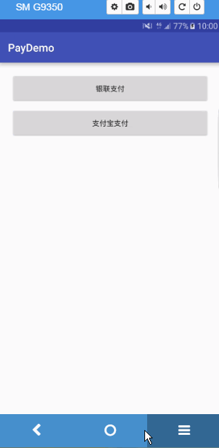
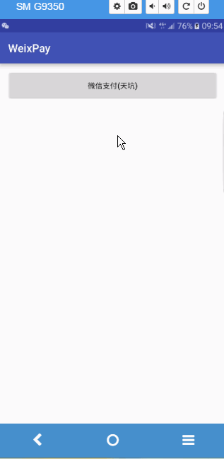

###README

####银联支付

* 1.集成：拷贝资源：assets/data.bin，so库，两个jar包；清单文件配置：权限和com.unionpay.uppay.PayActivity
* 2.调用：UPPayAssistEx.startPayByJAR(MainActivity.this, PayActivity.class, null, null,mTransalationNum, mode)，交易流水号，模式（正式、测试），银联还提供测试账号，可以在测试环境(mode=01)下使用
* 3.处理结果：onActivityResult
* 4.异步通知：银联服务器通知商户服务器支付结果，商户服务器在30分钟后，还没有收到，商户服务器主动向银联服务器发请求
* 5.交易流水号是银联服务器生成的，返回给商户服务器，商户服务器在返回给客户端

####支付宝支付

* 1.集成：拷贝一个jar包（以前的版本是需要引用lib工程）；清单文件配置：权限，**不需要拷贝activity**
* 2.调用：PayTask的pay方法，传入核心参数

* 3.处理结果：handler

* 4.异步通知：支付宝服务器通知商户服务器支付结果，如果商户反馈给支付宝的字符不是success这7个字符，支付宝服务器会不断重发通知，直到超过24小时22分钟。一般情况下，25小时以内完成8次通知（通知的间隔频率一般是：4m,10m,10m,1h,2h,6h,15h）

* 5.支付串码是由公司服务器生成的
* (由于支付宝不提供测试接口,本人能力有限写不了服务器,所以没有完成支付功能)

####微信支付

**微信采用了安全码策略,使用了签名+包名绑定了apk,最恶心的是微信支付返回码,提示很烂,遇到最多的就是-1,很多情况会遇到-1,比如签名不对,或者缓存,或者包名写错了.正因为微信的安全码策略,所以一般的demo是通过不了审核的,所以只能用微信官方的demo包名与签名,才能跑.因为之前支付过一次demo,所以有缓存,不能再支付了,但是可以返回数据.需要重新卸载安装微信,就能再支付**

* 1.集成：拷贝一个jar包、清单文档（权限，activity：  <activity android:name=".wxapi.WXPayEntryActivity"  android:exported="true"/>）
* 2.调用：初始PayReq对象里面的核心参数，然后调用api.sendReq(req)

* 3.处理支付结果：必须在   net.sourceforge.simcpux.wxapi.WXPayEntryActivity里面处理支付结果，该Activity不在sdk的jar中，所以需要拷贝到我们项目工程里面，**包名不能变**，否则接受不到结果

* 4. 异步通知：微信服务器通知商户服务器支付结果，商户服务器需要给微信服务器返回响应

* 5.除了prepayId是微信服务器生成的，其他参数都是商户服务器生成

    # TheThirdPay
